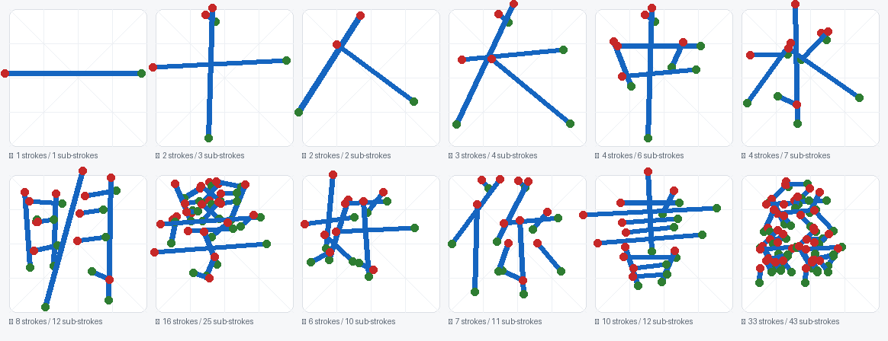

# Port notes: `hanzilookup-js` 1.0.3 → C#

This document records how the JavaScript implementation was translated, what is guaranteed to be
identical, which of its quirks are reproduced on purpose, and where this port deviates.

The source of truth is `hanzilookup-js@1.0.3`, `dist/hanzilookup.cjs.js` (677 lines, Rollup output of the
ES modules in that repository). The behavioral contract with the original is pinned by the reference
vectors in `tests/HanziLookup.Tests/TestData/reference-vectors.json`, which are produced by running the
JavaScript implementation itself - see [Regenerating the vectors](#regenerating-the-reference-vectors).

## 1. Class mapping

| JavaScript (`hanzilookup-js`) | C# | Notes |
| --- | --- | --- |
| `SubStroke(direction, length, centerX, centerY)` | `SubStroke` | Immutable; all four values are quantized `int`s. |
| `AnalyzedStroke(points, pivotIndexes, subStrokes)` | `AnalyzedStroke` | |
| `AnalyzedCharacter(rawStrokes)` | `AnalyzedCharacter` | Adds `Empty`, `FromStrokes`, `IsEmpty`, `StrokeCount`, `FlattenedSubStrokes`. |
| `CharacterMatch(character, score)` | `CharacterMatch` | Adds `HasFiniteScore`. |
| `MatchCollector(limit)` | `MatchCollector` | Same best-first insertion and duplicate removal. |
| `CubicCurve2D(...)` + `getYOnCurve` / `solveForX` / `getFirstSolutionForX` | `CubicCurve2D` | Same closed-form solver, same branch order. |
| `decodeCompact(base64)` | `CompactDataDecoder.Decode` | |
| `Matcher(dataName, looseness)` + `match(char, limit, ready)` + `getCounters()` | `Matcher` + `Match(...)` / `MatchAsync(...)` / `GetCounters()` | |
| `data[dataName]` + `init(dataName, url, ready)` | `HanziData`, `HanziDataStore` | Explicit objects instead of a module-level dictionary; the registry exists for parity. |
| (not present) | `RawStroke`, `HandwritingSession`, `StrokeSkeleton`, `StrokeOptions`/`MatchOptions`, `MatcherCounters` | Convenience layer for interactive front-ends; does not change matching. |

## 2. Numerical fidelity

The JavaScript implementation is extremely sensitive to the exact sequence of floating point operations,
so the port keeps them in the same order and uses the same helpers:

* **Rounding.** JavaScript's `Math.round()` rounds halves towards `+Infinity`. `JsMath.Round` uses
  `Math.Floor(value + 0.5)` accordingly (this differs from `Math.Round`'s banker's rounding, which would
  change directions and lengths).
* **Quantization.** Direction: `round(angle * 256 / PI / 2)`, with `256 → 0`. Length:
  `round(dist / sqrt(2 * max(width, height)^2) * 255)`, capped at 1 before scaling. Centre:
  `round(center * 15)`, where the centre is expressed in units of the larger dimension of the bounding
  box. All of these are stored as `int`s in the port, exactly like the packed bytes of the data file.
* **Score tables.** The direction table is sampled from the cubic `(0,1) (0.5,1) (0.25,-2) (1,1)`, the
  length table from `(0,0) (0.25,1) (0.75,1) (1,1)`, and the position table is `1 - sqrt(i)/22` for
  `i = 0..450`. All three are computed with the ported `CubicCurve2D` and are compared against the
  JavaScript values in the test suite.
* **Bounding rectangle** starts at `Number.MAX_SAFE_INTEGER` / `Number.MIN_SAFE_INTEGER`
  (`JsMath.MaxSafeInteger`) and is clamped afterwards with the same four ternaries, which is what gives an
  empty input the "default" box `(0,0)-(256,256)`.
* **Matrix arithmetic.** `skip1Score`, `skip2Score` and the length-ratio shift (`(length2 << 7) / length1`)
  are transcribed verbatim, including the fact that a zero length produces `NaN` (JavaScript `0/0`).

Where the original reads a value that JavaScript would report as `undefined` (an offset past the end of a
`Uint8Array`, an index greater than the table length), the port clamps or substitutes the value that
JavaScript's arithmetic effectively uses. These cases cannot occur with the shipped data, but they keep
the decoder total instead of producing an index-out-of-range exception.

## 3. Quirks of the original that are reproduced (by default)

1. **The sub-stroke pre-filter is inert.** `matcher.js` contains
   `if (cmpSubStrokes.length < minSubStrokes || ...) continue;`, but `cmpSubStrokes` is `repoChar[2]`, a
   *number*, so the condition is always false and candidates outside the sub-stroke window are compared
   anyway. `_computeMatchScore` leaves their score at `-Infinity` (`newScore` starts there and is only
   assigned inside the `Math.abs(x - y) <= subStrokesRange` branch). The result: whenever fewer characters
   pass the stroke-count filter than the requested `limit`, the tail of the result list is padded with
   `-Infinity` scores. This port reproduces that by default and removes it with
   `MatchOptions.Strict` (`FilterBySubStrokeCount = true`). Because the filter only ever removes entries
   whose score is `-Infinity`, the relative order and the scores of the remaining candidates are
   unchanged - the test suite asserts exactly this property for all 33 reference cases.
2. **The `ready` callback is not invoked for empty input.** `_doMatch` returns
   `matchCollector.getMatches()` *before* `ready(...)` when the input has no strokes. The C# `Match`
   simply returns an empty list, and the test suite documents the original behaviour through the
   `callbackInvoked` flag of the vectors.
3. **`limit <= 0` yields an empty result** (`MatchCollector` allocates an empty array / `limit` null
   slots). The port short-circuits instead of indexing into an empty array.
4. **The constructor coerces `looseness`:** `this._looseness = looseness || DEFAULT_LOOSENESS` turns `0`
   (and `NaN`) into `0.15`, even though `_getStrokesRange` has an explicit `if (this._looseness == 0)`
   branch. `Matcher(data, 0)` behaves the same in C#; use the `Looseness` property (or
   `new Matcher(data) { Looseness = 0 }`) to actually get a strict `0`.
5. **Duplicates and ordering** in `MatchCollector`: a character that is already present is replaced only
   when the new score is strictly better, and ties keep the earlier entry (`<` comparisons).
6. **`decodeCompact` reads padding as base64 index 0** and writes into the typed array without bounds
   checks (JavaScript silently drops writes past the end).

## 4. Deliberate deviations

| # | Deviation | Why |
| --- | --- | --- |
| 1 | Strokes with fewer than two points, or whose points all coincide, are **skipped**; the original divides by a zero-sized bounding box and produces `NaN` sub-strokes that poison the whole score matrix. | An interactive canvas produces stray taps (a pointer-down/up without movement) all the time; `NaN` scores would make the generic "no match found" path impossible. Degenerate strokes still contribute to the bounding rectangle, exactly like the original. |
| 2 | The score matrix grows when the input has more than `MAX_CHARACTER_SUB_STROKE_COUNT` (64) sub-strokes; the original writes past the end of its 65 × 65 matrix (silently in JavaScript, an exception in C#). | Accepting the input is strictly better than failing on it; for the shipped data the behaviour is identical. |
| 3 | `CompactDataDecoder` accepts input whose length is not a multiple of four; the original throws (`new ArrayBuffer(2.25)`). | Robustness for data embedded/trimmed by hand; the shipped data is unaffected. |
| 4 | `Matcher.MatchAsync` runs the scan on a thread pool thread and polls a `CancellationToken` every 1024 characters. | The matching scan is CPU bound (milliseconds to tens of milliseconds for the full data set) and a UI thread should not block on it. |
| 5 | Everything is strongly typed and validated: null checks, a typed exception for malformed data, `MatcherCounters` as a value type. | Idiomatic C#; no behaviour change. |

## 5. The inverse operation: drawing sub-strokes

`StrokeSkeleton` turns a quantized descriptor `(direction, length, centerX, centerY)` back into a drawable
segment in normalized coordinates. Inverting the analysis is not obvious, so the derivation is written
down here:

* Direction: the analysis stores `round(angle * 256 / PI / 2)` for `angle = PI - atan2(dy, dx)` measured on
  the *captured* points (canvas coordinates, `y` grows downwards). Writing `a = direction * PI / 128`, the
  travel direction of the segment is `(cos a, -sin a)`; the sign was verified empirically against 183
  sub-strokes of the reference cases (maximum deviation 0.70°, i.e. within the half of the 1.41°
  quantization step; using `(-cos a, sin a)` is 180° off).
* Length: the stored length is normalized by the **diagonal** of the bounding square
  (`side * sqrt(2)`) and scaled to 0..255, while the centre is normalized by the **side** and scaled to
  0..15. The half length in centre units is therefore `length / 255 * sqrt(2) / 2`.
* Centre: `(centerX / 15, centerY / 15)`.

The reconstruction is an approximation by construction - it cannot recover where inside its cell the real
segment ended - but it is faithful enough to draw the skeleton of a candidate character and to compare it
with the user's strokes. `SkeletonTests` asserts that the reconstructed direction of every sub-stroke of
every reference case stays within one half quantization step of the geometry it was computed from, and
that all 9507 repository characters expand to exactly `SubStrokeCount` segments.



The picture above was produced by `tools/preview/render-skeletons.py` (Pillow, no Avalonia involved):
it applies exactly the arithmetic described in this section to `data/mmah.json`. Each blue line is one
quantized sub-stroke, the red dot marks where the pen went down and the green dot where it was lifted -
which also shows how the strokes of a character are joined and split.

## 6. Test strategy

1. **Reference vectors (the main safety net).** `tools/reference/generate-reference-vectors.mjs` loads
   `data/mmah.json` into the real npm package (including `decodeCompact`), runs 33 cases through
   `AnalyzedCharacter` and `Matcher`, and records the analysis, the matches, the counters, the three score
   tables and samples of `solveForX` / `getFirstSolutionForX` on four curves. `ReferenceVectorTests` replays
   all of it: exact equality for the integer data, 1e-9 relative tolerance for floating point values.
2. **Behavioural tests.** Ordering, limits, empty input, looseness handling, thread safety, the async entry
   point and cancellation, the `MatchCollector` semantics, the data store, and the strict-mode property.
3. **Data integrity.** The SHA-256 of the decoded sub-stroke table (469479 bytes) is asserted, so a swapped
   data file cannot silently invalidate the pinned scores.
4. **Skeleton tests.** Covers the drawing layer described above.
5. **Headless UI smoke test.** `tests/HanziLookup.Demo.Tests` starts the real `MainWindow` on the headless
   Avalonia platform and draws a stroke through the input stack (raw pointer events, hit testing, capture),
   so data file resolution, analysis, matching, candidate rendering, the replay animation, a full
   compositor render pass and a real button click are all exercised without a display.

## 7. Regenerating the reference vectors

```bash
cd tools/reference
npm install                                   # hanzilookup-js@1.0.3 is pinned in the lock file

# without median strokes (fewer cases, no external files needed)
node generate-reference-vectors.mjs --data ../../data/mmah.json \
                                    --out ../../tests/HanziLookup.Tests/TestData/reference-vectors.json

# with the real median strokes of 一 人 大 中 水 明 你 好 學 書 (recommended; needs a HanziLookupJS checkout)
git clone --depth 1 https://github.com/gugray/HanziLookupJS /tmp/HanziLookupJS
node generate-reference-vectors.mjs --data ../../data/mmah.json \
                                    --medians /tmp/HanziLookupJS/library/data/x-mmah-medians.js \
                                    --out ../../tests/HanziLookup.Tests/TestData/reference-vectors.json
```

The generated file records the Node version, the data file hash and the exact npm package it came from, and
the script exits with a non-zero status if the npm package cannot be found. Note that `x-mmah-medians.js`
is **not** part of this repository; only the generated vectors are committed.
